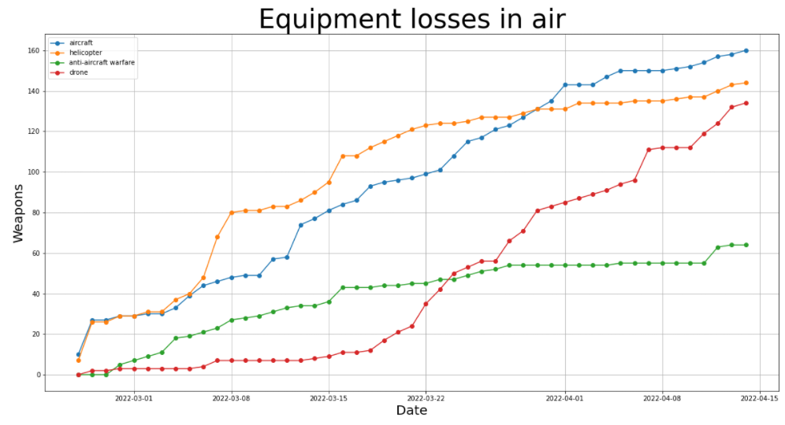
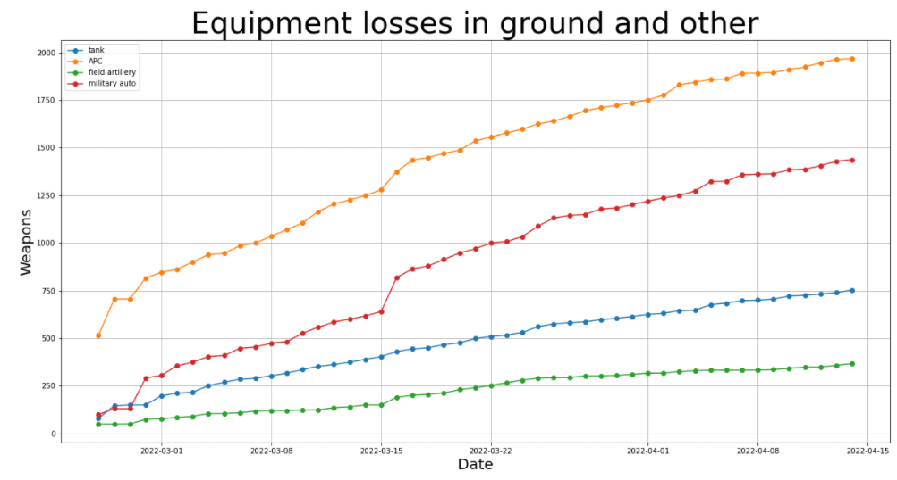

# 2022 Ukraine Russia War (50 first days of war) - Visualization

The dataset comes from https://www.kaggle.com/datasets/piterfm/2022-ukraine-russian-war. The dateset describes equipment losses, death toll, military wounded and prisoners of war of russians in Ukraine Russia War. #StandWithUkraine

**Important notice!** Each record is accumulated data from previous days.


```python
import numpy as np
import pandas as pd
import matplotlib.pyplot as plt

# Load equipment losses
ru_eq_losses = pd.read_csv('./data/russia_losses_equipment.csv')

# Load human losses
ru_per_losses = pd.read_csv('./data/russia_losses_personnel.csv')
```

### Personnel losses


```python
# Create data
x, y = ru_per_losses['date'], ru_per_losses['personnel']

# For displaying plots inline
%matplotlib inline

# Convert dates to datetime type
import datetime
x = [datetime.datetime.strptime(date, "%Y-%m-%d").date() for date in x]

# Create plot
fig = plt.figure()
fig.set_figwidth(20)
fig.set_figheight(10)

ax = fig.add_subplot(111)

ax.set_title('Personnel losses', size=40)
ax.set_ylabel('People', size=20)
ax.set_xlabel('Date', size=20)

ax.plot(x, y, marker="o")

plt.grid()
```


### Equipment losses in air


```python
# Create data
x = ru_eq_losses['date']

# Convert dates to datetime types
x = [datetime.datetime.strptime(date, "%Y-%m-%d").date() for date in x]

# Load the rest of the data
names = ['aircraft', 'helicopter', 'anti-aircraft warfare', 'drone']
y = [ru_eq_losses[name] for name in names]

# Create plots
fig = plt.figure()
fig.set_figwidth(20)
fig.set_figheight(10)

ax = fig.add_subplot(111)

ax.set_title('Equipment losses in air', size=40)
ax.set_ylabel('Weapons', size=20)
ax.set_xlabel('Date', size=20)

for y_data in y:
    ax.plot(x, y_data, marker = "o")

ax.legend(names)    

plt.grid()
```





### Equipment losses in ground and other


```python
# Create data
x = ru_eq_losses['date']

# Convert dates to datetime types
x = [datetime.datetime.strptime(date, "%Y-%m-%d").date() for date in x]

# Load the rest of the data
names = ['tank', 'APC', 'field artillery', 'military auto']
y = [ru_eq_losses[name] for name in names]

# Create plots
fig = plt.figure()
fig.set_figwidth(20)
fig.set_figheight(10)

ax = fig.add_subplot(111)

ax.set_title('Equipment losses in ground and other', size=40)
ax.set_ylabel('Weapons', size=20)
ax.set_xlabel('Date', size=20)

for y_data in y:
    ax.plot(x, y_data, marker = "o")

ax.legend(names)    

plt.grid()
```




